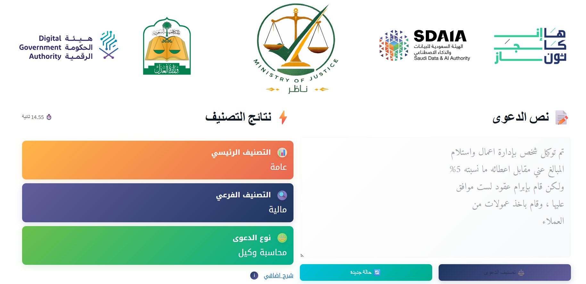
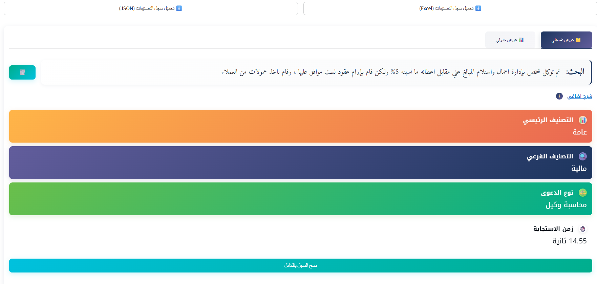

# Enjaz - ناظر Case Classification App

  

**Enjaz (ناظر)** is a Streamlit-based web application developed for the Enjaz Hackathon. This intelligent tool leverages the power of Google's Gemini API to automatically classify legal cases. Users can input case text, and the application provides a main classification, sub-classification, and case type, along with an explanation, streamlining the initial assessment process for legal documents. The app also maintains a history of classifications for review and export.

## Screenshots

Here's a glimpse of the Enjaz application in action:

### Main Interface

### Classification History

